# Core-Back Integration Map

## Service Boundary Diagram

```mermaid
graph TB
    subgraph "Inbound to Core-Back"
        CORE_FRONT["core-front<br/>(Private API Gateway)"]
        ORCH["Orchestration / RP<br/>(External API Gateway)"]
        F2F_CRI["F2F CRI<br/>(SQS queue)"]
        DCMAW_CRI["DCMAW Async CRI<br/>(SQS queue)"]
        STUB_CRI["Shared Stub CRI<br/>(SQS queue, dev/build/staging only)"]
        INTERNAL_TEST["Internal Testing Client<br/>(Internal Testing API Gateway)"]
        ANALYTICS["Analytics Consumer<br/>(Analytics API Gateway)"]
    end

    subgraph "Core-Back (current VPC)"
        direction TB
        PRIVATE_API["Private API Gateway<br/>(PRIVATE endpoint type)<br/>VPC Endpoint: ExecuteApiGateway"]
        EXTERNAL_API["External API Gateway<br/>(public, WAF protected)"]
        INTERNAL_API["Internal Testing API Gateway"]
        ANALYTICS_API["Analytics API Gateway"]

        subgraph "Step Function: Journey Engine"
            SF["JourneyEngineStepFunction"]
            SF --> PROCESS_JOURNEY["process-journey-event"]
            SF --> CHECK_EXISTING["check-existing-identity"]
            SF --> BUILD_CRI_OAUTH["build-cri-oauth-request"]
            SF --> BUILD_CLIENT_OAUTH["build-client-oauth-response"]
            SF --> CHECK_GPG45["check-gpg45-score"]
            SF --> CALL_DCMAW["call-dcmaw-async-cri"]
            SF --> RESET_SESSION["reset-session-identity"]
            SF --> CHECK_REVERIFICATION["check-reverification-identity"]
            SF --> PROCESS_CANDIDATE["process-candidate-identity"]
        end

        subgraph "API-triggered Lambdas"
            ISSUE_TOKEN["issue-client-access-token"]
            INIT_SESSION["initialise-ipv-session"]
            PROCESS_CRI_CB["process-cri-callback"]
            PROCESS_MOBILE_CB["process-mobile-app-callback"]
            CHECK_MOBILE_VC["check-mobile-app-vc-receipt"]
            BUILD_USER_ID["build-user-identity"]
            USER_REVERIFICATION["user-reverification"]
            BUILD_PROVEN["build-proven-user-identity-details"]
        end

        subgraph "SQS-triggered Lambdas"
            PROCESS_ASYNC["process-async-cri-credential"]
        end

        subgraph "DynamoDB Tables"
            SESSIONS[("SessionsTable")]
            CLIENT_OAUTH[("ClientOAuthSessionsTable")]
            CRI_OAUTH[("CriOAuthSessionsTable")]
            SESSION_CREDS[("SessionCredentialsTable")]
            CRI_RESPONSE[("CRIResponseTable")]
            CLIENT_JWT[("ClientAuthJwtIdsTable")]
        end
    end

    subgraph "Outbound from Core-Back"
        CIMIT["CIMIT API<br/>(HTTP via internet/NAT)"]
        EVCS["EVCS API<br/>(HTTP via internet/NAT)"]
        CRI_APIS["CRI APIs (all CRIs)<br/>(HTTP via internet/Network Firewall)"]
        TICF["TICF CRI<br/>(HTTP via internet)"]
        AUDIT_QUEUE["Audit Event SQS Queue<br/>(cross-stack import)"]
        SSM["SSM Parameter Store<br/>(VPC endpoint)"]
        SECRETS["Secrets Manager<br/>(VPC endpoint)"]
        APPCONFIG["AppConfig<br/>(VPC endpoint)"]
        DYNAMO_EP["DynamoDB<br/>(VPC endpoint)"]
        S3_EP["S3<br/>(VPC endpoint)"]
    end

    %% Inbound connections
    CORE_FRONT -->|"/session/initialise<br/>/journey/{step}<br/>/cri/callback<br/>/app/callback<br/>/app/check-vc-receipt"| PRIVATE_API
    ORCH -->|"/token<br/>/user-identity<br/>/reverification"| EXTERNAL_API
    F2F_CRI -->|"SQS EventSourceMapping<br/>BatchSize: 1"| PROCESS_ASYNC
    DCMAW_CRI -->|"SQS EventSourceMapping<br/>BatchSize: 1"| PROCESS_ASYNC
    STUB_CRI -->|"SQS EventSourceMapping<br/>BatchSize: 1"| PROCESS_ASYNC
    INTERNAL_TEST --> INTERNAL_API
    ANALYTICS --> ANALYTICS_API

    %% API to Lambda
    PRIVATE_API --> INIT_SESSION
    PRIVATE_API --> SF
    PRIVATE_API --> PROCESS_CRI_CB
    PRIVATE_API --> PROCESS_MOBILE_CB
    PRIVATE_API --> CHECK_MOBILE_VC
    EXTERNAL_API --> ISSUE_TOKEN
    EXTERNAL_API --> BUILD_USER_ID
    EXTERNAL_API --> USER_REVERIFICATION

    %% Outbound connections
    CALL_DCMAW -->|"HTTP: OAuth token + credential request"| CRI_APIS
    BUILD_CRI_OAUTH -->|"HTTP: OAuth authorize"| CRI_APIS
    PROCESS_CRI_CB -->|"HTTP: token + credential exchange"| CRI_APIS
    PROCESS_ASYNC -->|"HTTP POST /contra-indicators/detect"| CIMIT
    PROCESS_ASYNC -->|"HTTP POST /contra-indicators/mitigate"| CIMIT
    PROCESS_ASYNC -->|"HTTP: store pending VC"| EVCS
    CHECK_EXISTING -->|"HTTP: get user VCs"| EVCS
    CHECK_EXISTING -->|"HTTP: get contra-indicators"| CIMIT
    BUILD_USER_ID -->|"HTTP: get user VCs"| EVCS

    %% All lambdas to audit
    PROCESS_ASYNC -->|"SQS SendMessage"| AUDIT_QUEUE
    CALL_DCMAW -->|"SQS SendMessage"| AUDIT_QUEUE
    INIT_SESSION -->|"SQS SendMessage"| AUDIT_QUEUE
    PROCESS_CRI_CB -->|"SQS SendMessage"| AUDIT_QUEUE
    BUILD_USER_ID -->|"SQS SendMessage"| AUDIT_QUEUE

    %% AWS service access
    ISSUE_TOKEN -.->|"VPC endpoint"| DYNAMO_EP
    INIT_SESSION -.->|"VPC endpoint"| DYNAMO_EP
    PROCESS_JOURNEY -.->|"VPC endpoint"| SSM
    PROCESS_JOURNEY -.->|"VPC endpoint"| APPCONFIG
    CALL_DCMAW -.->|"VPC endpoint"| SECRETS

    style CIMIT fill:#ff9999
    style EVCS fill:#ff9999
    style CRI_APIS fill:#ff9999
    style AUDIT_QUEUE fill:#ffcc99
    style F2F_CRI fill:#99ccff
    style DCMAW_CRI fill:#99ccff
    style CORE_FRONT fill:#99ff99
    style ORCH fill:#99ff99
```

## VPC Migration Impact: What Needs to Change

### 1. INBOUND connections (things that call core-back)

| Source | How it connects | What changes on VPC move |
|--------|----------------|--------------------------|
| **core-front** | Private API Gateway via VPC Endpoint (`ExecuteApiGatewayEndpointId`) | New VPC endpoint needed in spoke VPC, or core-front must be able to reach the new VPC's endpoint. **If core-front is in a different VPC, this is the highest risk change.** |
| **Orchestration / RP** | External API Gateway (public internet) | **No change** — public endpoint, not VPC-dependent |
| **F2F CRI** | SQS queue owned by F2F, consumed by core-back Lambda | Lambda needs SQS VPC endpoint in new VPC, or NAT route to SQS. **Cross-account SQS — check KMS key access from new VPC.** |
| **DCMAW Async CRI** | SQS queue owned by DCMAW, consumed by core-back Lambda | Same as F2F — SQS + KMS access from new VPC |
| **Internal Testing** | API Gateway (public) | **No change** |
| **Analytics** | API Gateway (public) | **No change** |

### 2. OUTBOUND connections (things core-back calls)

| Destination | How it connects | What changes on VPC move |
|-------------|----------------|--------------------------|
| **CRI APIs (all CRIs)** | HTTPS via internet, Network Firewall allows only CRI domains | **New VPC needs NAT Gateway + Network Firewall rules (or equivalent) allowing CRI domains.** This is the biggest outbound risk — if firewall rules don't match, all CRI calls fail. |
| **CIMIT API** | HTTPS via internet/NAT | NAT Gateway route needed in new VPC |
| **EVCS API** | HTTPS via internet/NAT | NAT Gateway route needed in new VPC |
| **TICF CRI** | HTTPS via internet/NAT | NAT Gateway route needed in new VPC |
| **Audit SQS Queue** | SQS (cross-stack import: `AuditEventQueueUrl`) | Needs SQS VPC endpoint in new VPC, **plus KMS access** (`AuditEventQueueEncryptionKeyArn`) |
| **DynamoDB** | VPC Gateway Endpoint (prefix list `pl-b3a742da`) | **New VPC needs DynamoDB gateway endpoint.** Prefix list ID may differ. |
| **S3** | VPC Gateway Endpoint (prefix list `pl-7ca54015`) | **New VPC needs S3 gateway endpoint.** |
| **SSM Parameter Store** | VPC Interface Endpoint (`AWSServicesEndpointSecurityGroupId`) | **New VPC needs SSM VPC endpoint** |
| **Secrets Manager** | VPC Interface Endpoint | **New VPC needs Secrets Manager VPC endpoint** |
| **AppConfig** | VPC Interface Endpoint | **New VPC needs AppConfig VPC endpoint** |
| **SQS (sending audit)** | VPC Interface Endpoint | **New VPC needs SQS VPC endpoint** |
| **KMS** | VPC Interface Endpoint (for DynamoDB encryption, SQS encryption) | **New VPC needs KMS VPC endpoint** |

### 3. SECURITY GROUP changes

Current security group (`LambdaSecurityGroup`) has:

**Egress:**
- DynamoDB prefix list (`pl-b3a742da`) → port 443
- S3 prefix list (`pl-7ca54015`) → port 443
- AWS Services VPC endpoint security group (`${VpcStackName}-AWSServicesEndpointSecurityGroupId`) → port 443
- `0.0.0.0/0` → port 443 (internet via NAT/Network Firewall for CRI calls)

**Ingress:**
- VPC CIDR (`${VpcStackName}-VpcCidr`) → port 443

**On VPC move:**
- Security group must be recreated in new VPC (security groups are VPC-bound)
- Prefix list IDs are region-level, should stay the same
- `AWSServicesEndpointSecurityGroupId` must reference the **new VPC's** endpoint security group
- VPC CIDR ingress rule must match new VPC CIDR
- If core-front is in a different VPC, ingress may need to allow cross-VPC CIDR or use VPC peering/Transit Gateway

### 4. CROSS-STACK IMPORTS that will break

These CloudFormation imports reference the current VPC stack and will need updating:

| Import | Used for |
|--------|----------|
| `${VpcStackName}-ProtectedSubnetIdA` | Lambda VPC config |
| `${VpcStackName}-ProtectedSubnetIdB` | Lambda VPC config |
| `${VpcStackName}-ExecuteApiGatewayEndpointId` | Private API Gateway |
| `${VpcStackName}-AWSServicesEndpointSecurityGroupId` | Security group egress |
| `${VpcStackName}-VpcCidr` | Security group ingress |

**`VpcStackName` parameter must point to the new spoke VPC stack**, and that stack must export all the same values.

## Migration Risk Summary

| Risk | Severity | Why |
|------|----------|-----|
| **Private API Gateway unreachable** | 🔴 Critical | core-front can't reach core-back if VPC endpoint changes. All user journeys break. |
| **CRI outbound calls blocked** | 🔴 Critical | If Network Firewall / NAT not configured, no identity checks work |
| **SQS async credentials not consumed** | 🟠 High | F2F and DCMAW credentials pile up in queues, users stuck in pending state |
| **Audit queue unreachable** | 🟠 High | Lambdas block on `awaitAuditEvents()`, timeouts cascade |
| **DynamoDB unreachable** | 🔴 Critical | No sessions, no state, nothing works |
| **Secrets Manager unreachable** | 🔴 Critical | Can't get OAuth secrets, all CRI integrations fail |
| **KMS unreachable** | 🔴 Critical | Can't decrypt DynamoDB, can't encrypt/decrypt SQS messages |
