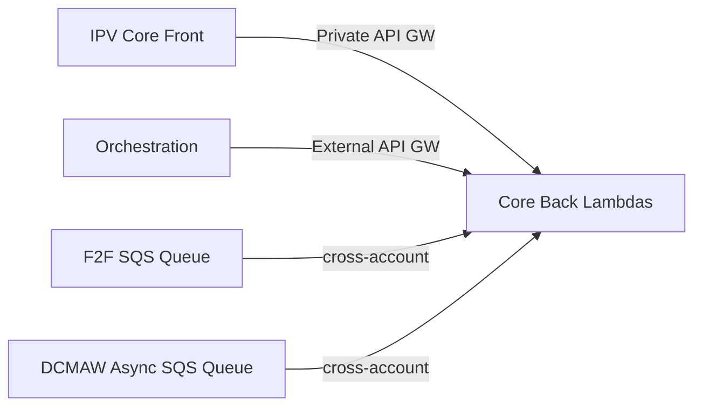
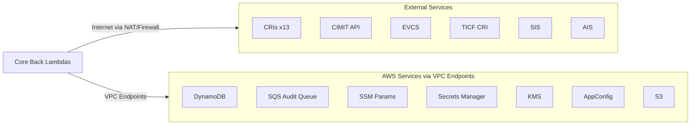

# IPV Core Back — VPC Migration Map

## What calls Core Back (Inbound)

## What Core Back calls (Outbound)

## What needs updating in new VPC

| What | Why |
|---|---|
| **ProtectedSubnetIdA/B** | All lambdas run here |
| **VpcId / VpcCidr** | Security group references |
| **LambdaSecurityGroup** | Recreate with same egress/ingress rules |
| **DynamoDB + S3 Gateway Endpoints** | Lambdas access these via prefix lists |
| **Interface Endpoints** (SSM, Secrets Manager, SQS, KMS, AppConfig) | Lambdas access these via endpoint SG |
| **Execute API Gateway Endpoint** | Core Front reaches Private API through this |
| **NAT Gateway + Network Firewall routes** | Outbound HTTPS to CRIs and external APIs |
| **Cross-account SQS access** (F2F, DCMAW) | EventSourceMappings need network path from new VPC |
