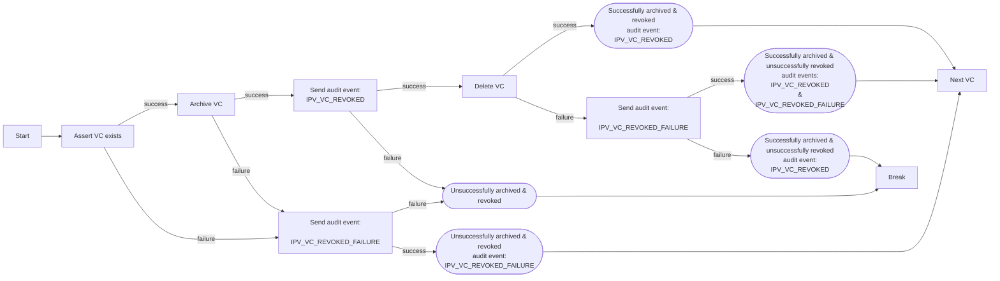

# RevokeVcsHandler

What this lambda is for and does: https://govukverify.atlassian.net/browse/PYIC-4555

To run this lambda, create an appropriate payload including userIds with vcs in the the appropriate environment.

```bash
aws-vault exec <profile> -- aws lambda invoke --function-name revoke-vcs-<env> --invocation-type RequestResponse --payload fileb://revokeVcsLambdaPayload.json response.json
```

This lambda iterates the `userId` and `criId` pairs and for each:
1. Archives the vc, entering it into the `revoked-user-credentials-{env}` table
2. Sends `IPV_VC_REVOKED` audit event
3. Deletes the vc in the `user-issued-credentials-v2-{env}` table

For each VC we try to delete we will do the following:


Either the process works or we get one of the two following failure paths:
1. `IPV_VC_REVOKED_FAILURE` audit event
2. The loop is broken and logs indicate why and where

Either way, we can identify what error caused each failure path in the logs, and the progress through the list at which it occurred.
